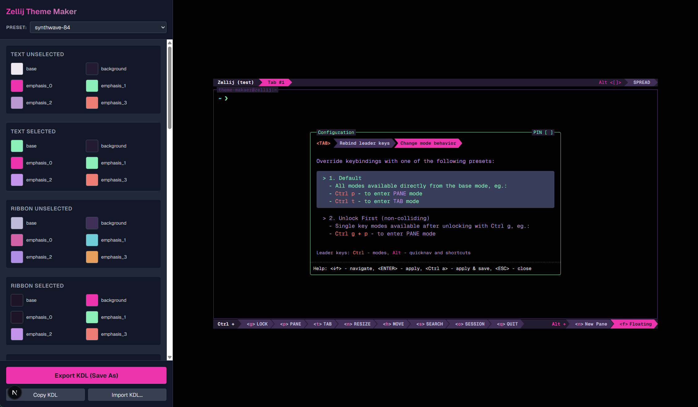

# Zellij Theme Maker

[中文文档](./README_zh.md)

A web-based theme editor for [Zellij](https://zellij.dev) with live preview, interactive color picker, and KDL export.



## Features

- Live color editing with visual color picker
- Real-time terminal preview
- Export to KDL format (copy to clipboard or download)
- Import existing KDL theme files
- Built-in preset themes (Synthwave 84, Dracula, Nord, Catppuccin)

## Getting Started

```bash
npm install
npm run dev
```

Visit http://localhost:3000 to see the app.

## Build

```bash
npm run build
npm start
```

## Tech Stack

- Next.js 16
- React 19
- TypeScript
- Tailwind CSS v4
- react-colorful

## Preset Themes

- **Synthwave 84** - Neon retro style
- **Dracula** - Purple-toned dark theme
- **Nord** - Blue-gray cool-toned theme
- **Catppuccin** - Pastel soft-toned theme

## Zellij Theme Format

Zellij themes use KDL format with the following UI components:

- text_unselected / text_selected
- ribbon_unselected / ribbon_selected
- table_title / table_cell_unselected / table_cell_selected
- list_unselected / list_selected
- frame_unselected / frame_selected / frame_highlight
- exit_code_success / exit_code_error

Each component has 5 color attributes:
- base
- background
- emphasis_0 / emphasis_1 / emphasis_2 / emphasis_3
